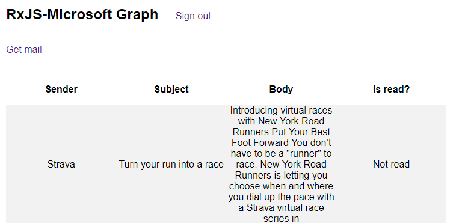

# RxJS-Microsoft Graph
## About
This is a starting point for building [RxJS-based](http://reactivex.io/rxjs/) web apps that talk to the [Microsoft Graph API](https://graph.microsoft.com). This provides an observable set of wrappers on top of MSAL APIs for signing a user in, and provides an observable that emits access tokens for the Microsoft Graph API. In this sample app, these tokens are used to fetch emails using the Graph /messages endpoint.



## What is RxJS?
[Reactive JS](http://reactivex.io/rxjs/) is an asynchronous programming paradigm in which app events are modeled as 'observables' or streams. Your app's logic becomes operations on observables - filtering, merging, chaining and subscribing to such streams.

For instance, the following observable `responseStream` maps emitted events from the `tokenStream` and creates a new observable representing a HTTP request. This is flattened into a single stream (vs. a stream of streams) and is combined with the user action of clicking on a particular button. The resulting combination of these two events (a token emitted and a button click emitted) is combined by only taking the response of the emitted token and forwarding it on.

```javascript 
const responseStream = tokenStream.flatMap((token) => {
      const headers = {"Authorization": "Bearer "+  token.value };
      return Rx.Observable.fromPromise(fetch(graphAPIMailEndpoint, {headers: headers}));
}).combineLatest(mailBtnClickStream, (resp, click) => { return resp });
```

## How to run
1) Register a new SPA in the [Application Registration Portal](https://apps.dev.microsoft.com)
2) Add your app id to `config/constants.js`
3) Run `npm install` to install the required dependencies
4) Build using `webpack`
5) Run `npm start` to run the app
6) Visit `http://localhost:8080` in your browser

